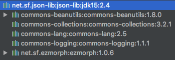

# 为什么写

项目有一份[GeoJson](https://geojson.org/)数据，需要处理，因此用到一些json的工具包。最开始使用了`net.sf.json`，然后就遇到了经纬度丢失精度的问题（因为在`net.sf.json`下的JSON转换时，会首先默认将数据转换为float类型，因此在数字转为float时，已经发生了错误）。然后发现其实java的json工具包还挺多的，因此总结一下。

# 各种json包

- Json-lib
- Gson
- FastJson
- Jackson

# Json-lib

> json-lib最开始应用的json解析工具，json-lib 需要依赖很多第三方包，包括commons-beanutils.jar，commons-collections-3.2.jar，commons-lang-2.6.jar，commons-logging-1.1.1.jar，ezmorph-1.0.6.jar，对于复杂类型的转换，json-lib对于json转换成bean还有缺陷，比如一个类里面会出现另一个类的list或者map集合，json-lib从json到bean的转换就会出现问题。json-lib在功能和性能上面都不能满足现在互联网化的需求。

- 官网：http://json-lib.sourceforge.net/index.html

- maven仓库：https://mvnrepository.com/artifact/net.sf.json-lib/json-lib

- 在maven依赖中，可以看到该jar包依赖的其他jar包：

	

- 主要通过`JSONObject`、`JSONArray`对象来操作

- 使用示例：

	```java
	import com.kris.jsonlib.bean.User;
	import net.sf.json.JSONArray;
	import net.sf.json.JSONObject;

	/**
	* @author Kairou Zeng
	*/
	public class JsonLibTest {

		public static void main(String[] args) {
			User user = new User();
			user.setId("1");
			user.setName("Kris");
			user.setAge(18);
			user.setMale(false);
			user.setWeight(100.123456);

			System.out.println("======User To JsonObject========");
			JSONObject jsonObject = JSONObject.fromObject(user);
			System.out.println("JsonObject:" + jsonObject);
			System.out.println("======JsonObject To String========");
			String userStr = jsonObject.toString();
			System.out.println("String:" + userStr);


			System.out.println("======String To JsonObject========");
			JSONObject fromStrJsonObject = JSONObject.fromObject(userStr);
			System.out.println("JsonObject:" + fromStrJsonObject);
			User fromJsonObject = (User) JSONObject.toBean(fromStrJsonObject, User.class);
			System.out.println(fromJsonObject);
			System.out.println("weight:" + fromStrJsonObject.get("weight"));//丢失精度了
			fromStrJsonObject.put("description", "添加一个属性");
			System.out.println(fromStrJsonObject);

			JSONArray jsonArray = new JSONArray();
			jsonArray.add(jsonObject);
			jsonArray.add(user);
			System.out.println("======Json Array====");
			System.out.println(jsonArray);
		}
	}
	```

# Gson

# FastJson

# Jackson